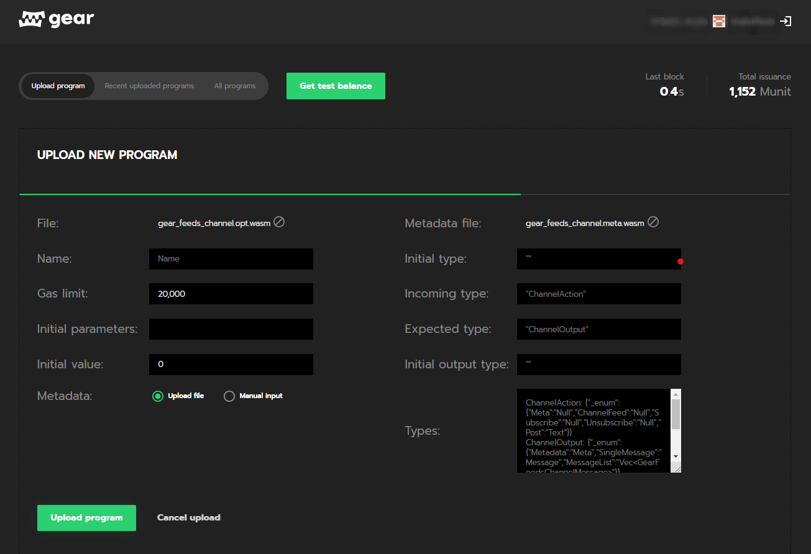

<p align="center">
  <a href="https://gear-tech.io">
    
  </a>
</p>

<h1 align="center"> 
The most advanced smart-contract engine
</h1>

<p align="center">
 <br>
Gear is a Substrate-based smart-contract platform allowing anyone to run dApp in a few minutes.
</p>

# 

<div align="center">

[![CI][c1]][c2]
[![GitHubStars][g1]][g2] 
[![Discord][d1]][d2] 
[![Twitter][t1]][t2] 
[![License][l1]][l2] 

[c1]: https://github.com/gear-tech/gear/workflows/CI/badge.svg
[c2]: https://github.com/gear-tech/gear/actions/workflows/CI.yaml

[g1]: https://img.shields.io/github/stars/gear-tech/gear?style=flat-square&label=Stars
[g2]: https://github.com/gear-tech/gear

[t1]: https://img.shields.io/twitter/follow/gear_techs?style=social
[t2]: https://twitter.com/gear_techs

[d1]: https://img.shields.io/discord/891063355526217738?style=flat-square&label=Discord
[d2]: https://discord.com/invite/7BQznC9uD9

[l1]: https://img.shields.io/badge/License-GPL%203.0-success
[l2]: https://github.com/gear-tech/gear/blob/master/LICENSE
</div>

<h4 align="center">Hit the <a href="https://github.com/gear-tech/gear">:star:</a> button to keep up with our daily progress!</h4>

# ⚙️ What does Gear do?

<p align="center">
<br>Gear provides the easiest and most cost-effective way <br>to run WebAssembly programs (smart-contracts) compiled from <br>many popular languages, such as Rust, C/C++ and more.
</p>
<p align="center">
<br>Gear ensures very minimal, intuitive, and sufficient API <br>for running both newly written and existing programs <br>on multiple networks without the need to rewrite them.
</p>
<p align="center">
<br>Smart Contracts are stored in the blockchain’s state <br>and are invoked preserving their state upon request.
</p>
<p align="center">
<br>GEAR enables a seamless transition to Web3, <br>alows running dApps, microservices, middleware, open APIs.
</p>

### :fire: Key features

 - Programs run in WASM WM (near-native code execution speed)
 - **Unique** :crown: : Parallelizable architecture (even greater speed)
 - **Unique** :crown: : Actor model for message-passing communications - secure, effective, clear
 - dApp in minutes using GEAR libraries
 - Based on Substrate

### :bulb: Main capabilities

Gear allows anyone to create and run any custom-logic dApp and is a go-to solution for the following types of applications:
  - A **self-contained blockchain** network (and very fast).
  - A standalone instance running microservices, middleware, open API and more
  - Being a **Polkadot parachain**, establish cross-chain communications between other blockchains. Allow anyone to run a dApp in the Polkadot network in a very **cost-less** manner.
  - Join Substrate-supported blockchains in any other platform outside Polkadot.
  
  # 🧐 Why?

The blockchain technology launched a rapid transition from centralized, server-based internet (Web2) to decentralized, distributed one (Web3). 

Web3 introduces a new type of decentralized applications (dApps) that enable the existence of DeFi, DEX, Decentralized marketplaces, NFTs, Creators and Social Tokens.

Smart Contract is an equivalent of a microservice which is stored on the blockchain network and is the essential building block of a decentralized application.

Modern blockchains solve many issues of the older blockchain networks, such as:
 - Lack of scalability, low transaction speed, high transaction costs
 - Domain-specific development language (high barrier to entry)
 - Complex and inefficient native consensus protocols
 - Absence of intercommunication tools

But still have room for improvements due to:
 - Fixated, rigid native consensus protocols
 - Lack of interoperability with other networks

To resolve the interoperability issue, Parity technologies focused on creating a technology that connects every other blockchain: 
  - Polkadot - a blockchain of blockchains. Provides a “relay chain” (the primary blockchain) that allows “parachains” (functional blockchains) to be deployed on top of it. All parachains are interconnected, creating a massive network of multifunctional blockchain services.
  - Substrate - a modular framework that allows to create custom-built blockchains with consensus mechanism, core functionality and security out of the box.

Building a blockchain with Substrate allows it to be deployed on any compatible relay chain such as Polkadot and Kusama
Substrate serves as a layer of communication between the relay chain and the parachain

# :factory: How does it work?

The internal flow of Gear:

  

Refer to the <a href="https://github.com/gear-tech/gear-technical/blob/master/TECHNICAL.pdf">technical paper</a> for some insights about how Gear works internally.

# :books: Gear components

* [core](https://github.com/gear-tech/gear/tree/master/core) - Gear engine for distributed computing core components.

* [node](https://github.com/gear-tech/gear/tree/master/node) - Gear substrate-based node, ready for hacking :rocket:.

* [gstd](https://github.com/gear-tech/gear/tree/master/gstd) - Standard library for Gear smart contracts.

* [examples](https://github.com/gear-tech/gear/tree/master/examples) - Gear smart contract examples.


# :baby: Getting Started

1. To start familiarity with Gear, download and run Gear node connected to the testnet.

2. Build your smart-contract into WASM 

2. Deploy and test smart contract, check how it is going. A comprehensive amount of smart contract examples is available for your convenience and faster onboarding.

## :computer: 1. Run Gear Node

....Some node Badge...?

1. Download nightly build of Gear node:

    - **Windows x64**: [gear-nightly-windows-x86_64.zip](https://builds.gear.rs/gear-nightly-windows-x86_64.zip)
    - **macOS M1**: [gear-nightly-macos-m1.tar.gz](https://builds.gear.rs/gear-nightly-macos-m1.tar.gz)
    - **macOS Intel x64**: [gear-nightly-macos-x86_64.tar.gz](https://builds.gear.rs/gear-nightly-macos-x86_64.tar.gz)
    - **Linux x64**: [gear-nightly-linux-x86_64.tar.xz](https://builds.gear.rs/gear-nightly-linux-x86_64.tar.xz)

2. Run Gear node without special arguments to get a node connected to the testnet:

    ```bash
    gear-node
    ```

3. Get more info about usage details, flags, avilable options and subcommands:

    ```bash
    gear-node --help
    ```

Gear node can run in a single Dev Net mode or you can create a Multi-Node local testnet or make your own build of Gear node.

Refer to the [Gear Node README](https://github.com/gear-tech/gear/tree/master/node) for details and some examples.

## :scroll: Write and prepare your smart-contract

You can take your own program writeen on general purpose language (Rust) or use one of provided [examples](https://github.com/gear-tech/gear/tree/master/examples).

Follow the [instruction](https://github.com/gear-tech/gear/blob/master/examples/README.md) to compile the Rust to WebAssembly program.

## :runner: Run you first smart contract

    
### Upload program from UI
    
1. Go to [https://idea.gear-tech.io](https://idea.gear-tech.io)

2. Sign-in to Gear via Telegram or Github account

3. Connect to your node:
    1. TBD

4. Click **Upload program** and choose compiled .wasm file to upload
    1. Set enough Gas limit - 1 000 000
    2. Intial parameters, Initial value - keep default
    3. Upload file with Metadata, if applicable
        1. the file can be found after program compilation from available examples
    4. Click **Upload program**, wait for the program initialization

 <br>

6. Try sending message to program, check reply:
    1. TBD... 

### Upload program locally from cmd
    
Alternatively youcan upload program locally on your node: 

TBD...

# Contribution

You can request a new feature by creating a new Issue or discuss it with us on Discord. 
Here are some features in-prog or planned: https://github.com/gear-tech/gear/issues

# License

Gear is licensed under [GPL v3.0 with a classpath linking exception](LICENSE).

##

<h4>
<p align="left" nowrap>
    <a href="https://twitter.com/gear_techs">
        
    </a> 
    <a href="https://github.com/gear-tech">
        
    </a> 
    <a href="https://discord.gg/7BQznC9uD9">
        
    </a> 
    <a href="https://medium.com/@gear_techs">
        
    </a>
    <br>
    <a href="https://wiki.gear-tech.io/" nowrap>
       Wiki
    </a> •
    <a href="https://gear-tech.io/#community">
      Community
    </a> •
    <a href="https://gear-tech.io/events.html">
      Events
    </a> •
    <a href="https://gear-tech.io/#about">
      About us
    </a>
</p>
</h4>